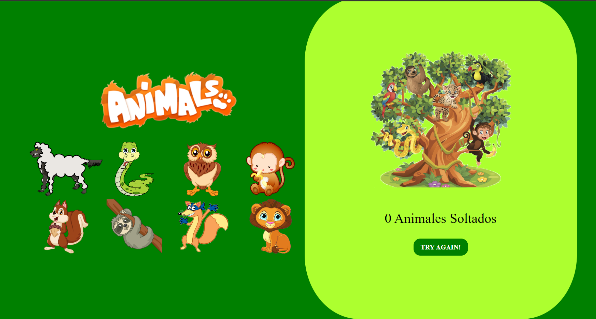

#  DRAGG AND DROP 

En este proyecto haremos uso de las propiedades Dragg and Drop y demostraremos su funcionamiento, su funcioón básica es arrastrar una imagen a un contador y que este nos sume o reste un valor al total.
## Proyecto dragg and drop  

Podemos acceder directamente al index desde este enlace [drag&drop](https://github.com/PeterManga/Dragg-and-Drop/blob/c4412d9cb5a0a06a238a06c781a25a279ab67c68/index.html).

Nuestro objetivo será liberar a la mayior cantidad posible de animales.
## Haremos uso de las siguientes tecnologias

  

## Futuras Mejoras 
Introducir una reja en frente de los animales para simbolizar que estan  siendo retenidos y tenemos que liberarlos en la selva
Animacion de cambio de imagen al arrastrar un animal a la selva
sonido característico de cada animal al seleccionarlo.
animacion al lograr cierca cantidad de animales liberados, y al no conseguirlo.

## Agradecimientos 
A todo el personal de urbalab, a mis compañeros y en especial al profesor David que ha estado muy atento a todos nosotros

## Contacto 

 man.pedrom@gmail.com

